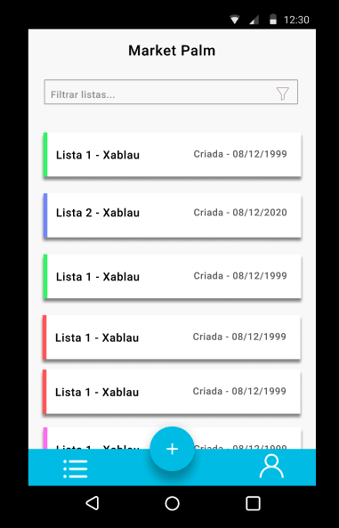

<h1 align="center">Welcome to mkt-palm 👋 🛒</h1>
<p>
  
  <a href="#" target="_blank">
    
  </a>
</p>

> The modern way to market. Create your own editable lists to use when you will shop, market ou a todo list.

## Install

```sh
yarn install
```

## Usage

```sh
yarn run start
```

## Run tests

```sh
yarn run test
```

## Preview

<div style="width: 100%; display: flex; justify-content: center;">
  
</div>

## Technologies

  - Javascript ES6 
  - ReactJS
  - Styled Components
  - Styled System
  - StoryBook

## Show your support

Give a ⭐️  if this project helped you!

Pull requests are welcome: [Figma](https://www.figma.com/file/mtY5Ek7UlqIJO4plI4Vb1c/mkt-palm?node-id=0%3A1)
